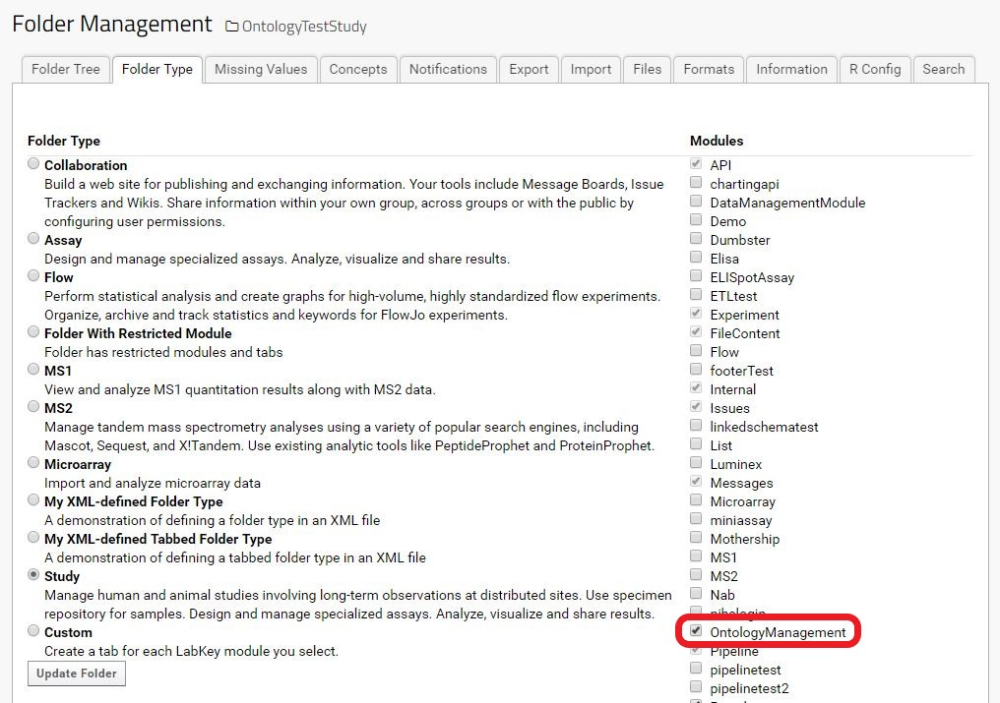
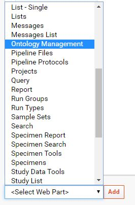
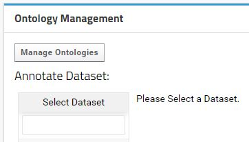
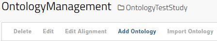
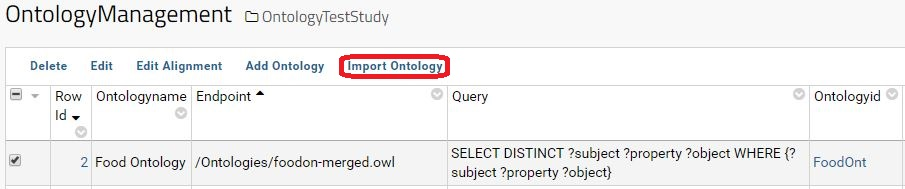
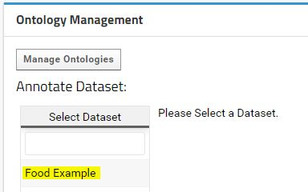
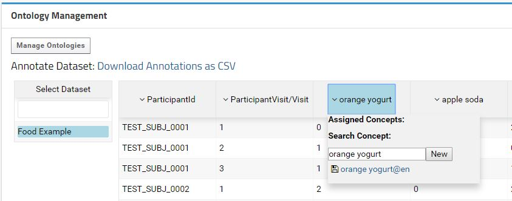
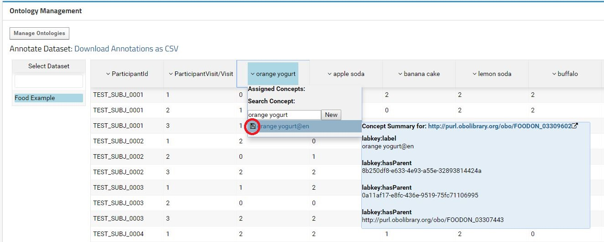
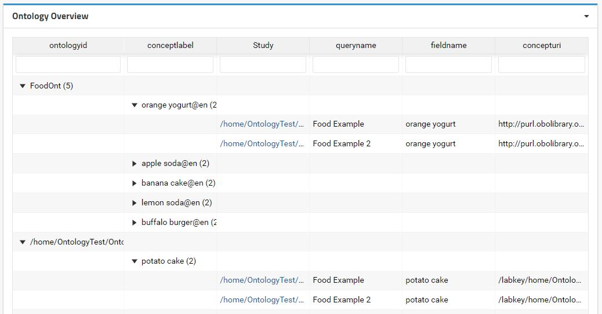
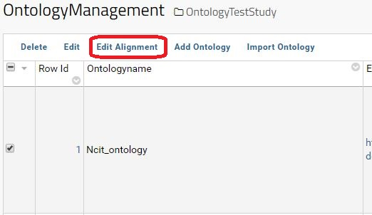

Ontology Management Module for LabKey.
======

This module provides tools to:
 - Align external ontologies with LabKey concepts.
 - Import relevant information from external ontologies to LabKey.
 - Semantically annotate LabKey datasets.


## Installation Instructions

### Requirements
* LabKey version 18.2 +
* PostgreSQL Database.
* Tested in Linux environment.
* [LabKey Development Machine](https://www.labkey.org/Documentation/wiki-page.view?name=devMachine) (to build).

### Build and deployment in development [(See: Build LabKey from Source)](https://www.labkey.org/Documentation/wiki-page.view?name=buildLabKey)

1. Download the source code to `labkey/server/optionalModules/ontologymanagement`

2. Include the following lines in `labkey/settings.Gradle`:
    ```gradle
    include 'server:optionalModules:ontologymanagement'
    findProject(':server:optionalModules:ontologymanagement')?.name = 'ontologymanagement'
    ```
3. Compile the module with gradle:
    ```
    gradlew :server:optionalmodules:ontologymanagement:deployModule
    ```
### Deployment in production
1. Compile module in production mode [(See: Build LabKey from Source)](https://www.labkey.org/Documentation/wiki-page.view?name=buildLabKey)
2. Copy (`ontologymanagement-18.3-SNAPSHOT.module`) to `labkey/externalModules`
3. Restart LabKey. 
 
### Configuration

1. Enable the Ontology Module in the folder [(See: Enable Module in Folder)](https://www.labkey.org/Documentation/wiki-page.view?name=enableModuleInFolder)
    ```
   SettingsMenu > Folder > Management > Folder Type tab > Ontology management
    ```
    

2. Add the `Ontology Management` Webpart to the desired page.

    

## Basic Example
This example demonstrates a basic import of all available concepts from an ontology that have their labels described according the W3C recommendation:`rdfs:label`.

For this example, we will use the [Food Ontology](http://foodontology.github.io/foodon/). The ontology file `foodon-merged.owl` can be found in the FoodOntology [git repository](https://github.com/FoodOntology/foodon) under `/src/ontology`. Please download the ontology file and save it in the LabKey local machine (e.g. `/ontologies/foodon-merged.owl`).

The ontologies are managed by container (i.e. Project/Study). If you want to specify a global ontology to be use across multiple projects, please use the default LabKey Shared folder.

### 1. Add Ontology in LabKey

Access the Ontology Management Interface by clicking on the `Manage Ontologies` button available in the Ontology Management Web Part.



In the Ontology Management Interface, click in the button `Add Ontology` to add a new Ontology.



The display form allows configuring the Ontology properties. To keep this example simple, some default values are used:

| Parameter | Description | This Example
|-----------|-------------|-------------| 
| Ontologyname | name of the ontology |Food Ontology
| Endpoint | Can be a HTTP address for a SPARQL endpoint or full local address for an ontology file |`/ontologies/foodon-merged.owl`
| Query | Sparql Query to be executed | (default)
| Ontologyid | Ontology identifier without spaces. | FoodOnt

 At this point, any data from the ontology is import to LabKey.

 ### 2. Import Ontology
When the ontology is add to LabKey and correctly configured, the relevant data from that ontology can be load to LabKey. To import the data please select the ontology and hit the button `Import Ontology`.



A pipeline will be launch and the import status will change to `Importing`. The pipeline can be managed in the [LabKey pipeline interface](https://www.labkey.org/Documentation/wiki-page.view?name=pipeline) if you are admin.

For this example, the import will take some minutes (depending the LabKey machine performance). Once done, the Import Status will change to `Complete`.

A data grid with the imported data is accessible by clicking in the respective `Ontologyid` in the Ontology Management Interface.

### 3. Dataset Annotation
Once the ontology data is import to LabKey, the study datasets can be annotate with the ontology concepts.
The Ontology Management Webpart provides an interface to perform the annotation. For this example please consider the following food questioner dataset ["media/FoodExampleDataset.csv"](media/FoodExampleDataset.csv) as example.

After create the `Food Example` dataset with the data in ["media/FoodExampleDataset.csv"](media/FoodExampleDataset.csv), the dataset will appear in the Ontology Management Webpart.



If you select the `Food Example` dataset, a table with the data will appear next to it. This table displays a preview of the data to help the user annotate the fields with the correct ontology concepts. Each field can be annotated with an ontology concept by using a dropdown menu that appears when click in a field.


The concepts are search on the ontologies imported within same container, parent container or in the Shared folder. The default value to search is the field label. The user can search more concepts just by typing in the text field. On mouse-over the concept, the data related with that concept is display in a submenu. To annotate a field with a concept just hit the save button at the left of the concept label.


When hit the save button, the annotation will be registered in the database and the concept will appear in the Assigned Concepts. In the case of the concept does not exist in the available ontologies, a new concept can be created by clicking in the `New` button. For simplification, a new ontology is automatically create for each dataset. The path for the dataset (container + schema + query) is use as Ontology Id and Ontology name. Those automatic entries can be latter revised and edited trough the Ontology Management Interface. 

### 4. View and download Annotations

The field annotations are stored in the database. The Ontology Management Webpart contains a link to download the annotations for a specific dataset.

This module also provides a concept overview across all projects that the user have access. By add the `Ontology Overview` to a global folder (i.e. Shared Folder) it is possible to navigate through the concepts used to annotate the datasets and retrieve which datasets have a certain concept.



## Example with advanced configuration

This example demonstrates a more advance dataset annotation where an ontology is directly import from a SPARQL endpoint and the import process requires extra alignment between the ontology and the LabKey concepts.    

For this example, we will use the [National Cancer Institute Thesaurus](https://ncit.nci.nih.gov). The ontology can be found in the NCI Thesaurus [repository](https://evs.nci.nih.gov/ftp1/NCI_Thesaurus/). This is a relatively large ontology and for better performance is advisable to load it on a triple-store accessible through a SPARQL endpoint.

### 1. Add Ontology in LabKey
The ontology is add into LabKey, similarly to the previous example. In this example, two main differences exist: (1) The endpoint has a HTTP address for the SPARQL endpoint instead of a local address for an OWL file and (2) the SPARQL query is a custom query to extract only the relevant information from the Ontology. Consider the following configuration:

| Parameter | Description | This Example|
|-----------|-------------|-------------| 
| Ontologyname | name of the ontology | Ncit Ontology	
| Endpoint | HTTP address for a SPARQL endpoint | http://.../Ncit/query
| Query | Sparql Query to be executed | (see below) 
| Ontologyid | Ontology identifier without spaces. | Ncit_ontology

Sparql Query:

```
PREFIX rdfs: <http://www.w3.org/2000/01/rdf-schema#> 
PREFIX nci: <http://ncicb.nci.nih.gov/xml/owl/EVS/Thesaurus.owl#> 
PREFIX owl: <http://www.w3.org/2002/07/owl#>
SELECT DISTINCT ?subject ?property ?object WHERE {
?subject a owl:Class.
?subject ?property ?object. 
?subject rdfs:label | nci:P97 | nci:P325 | nci:P350 | nci:P90 | rdfs:subClassOf ?object.
}
```
The default SPARQL query captures all the possible triples from an ontology. Customize this query provides flexibility to capture only specific data defined in the ontology without the need of importing all the triples from the ontology. This module is expecting the SPARQL output in the form of triples i.e.`(?subject ?property ?object)`.
In this example the SPARQL query will get all concepts of the type `owl:Class`. Then for each concept, it will capture the following concept properties:
* `rdfs:label` - Standard RDF property to describe a concept label.
* `rdfs:subClassOf` - Standard RDF property to describe a concept hierarchy.
* `nci:P97` - NCI specific property to describe the concept main definition.
* `nci:P325` - NCI specific property to describe the alternative definition.
* `nci:P325` - NCI specific property to describe the Chemical_Formula.
* `nci:P90` - NCI specific property to describe a synonym for the concept.

### 2. Edit LabKey Alignment

To integrate concepts describe according different ontologies, an ontology alignment table is available. The table aims to align the external ontologies with the LabKey concepts.

To access the Alignment table, please select an existing ontology and click on `Edit Alignment` button.




In this moment, some LabKey concepts are define in this module:

| Concept | Description | Usage |
|-----------|-------------|-------------|
|`labkey:label`|Concept label.| It's value is used to label the concepts. The label is consider the most relevant field when searching a concept. |
|`labkey:altLabel`|It is an alternative Label for a concept.|It is used when searching a concept but with a lower relevancy than `labkey:label` |
|`labkey:hasParent`|Defines the concept hierarchy.|(Not used Yet)|
|`labkey:definition`|Main concept definition / description.|(Not used Yet)|
|`labkey:altDefinition`| Alternative concept definition/description|(Not used Yet)|

When create the ontology, some default alignments are automatically setup. The default alignments are defined in the file `resources/web/defaultLabkeyAlignment.json`. We expect that the default alignments will improve in the future by community contributions. The default alignments at this point are:


| OntologyProperty | LabKeyproperty | 
|-----------|-------------|
|rdfs:label|labkey:label|
|rdfs:subClassOf|labkey:hasParent|
|skos:prefLabel|labkey:label|
|skos:altLabel|labkey:altLabel|
|skos:hiddenLabel|labkey:altLabel|

Those alignments provide the basic to import the concepts and their labels from the ontologies that adopt one of the two W3C recommendations: Resource Description Framework Schema ([RDFS](https://www.w3.org/TR/rdf-schema/)) or the Simple Knowledge Organization System ([SKOS](https://www.w3.org/TR/skos-reference/)). 

### 3. Import Ontology
Once the ontology is add with success to LabKey and correctly aligned with the LabKey concepts, the import is perform by clicking in the "import ontology" button as in the previous example.
The Background import pipeline can take several minutes depending the triplestore performance.

### 4. Dataset Annotation
For this example, please consider the following dataset about minerals measurements ["media/MineralsExampleDataset.csv"](media/MineralsExampleDataset.csv) as example. After create the `Minerals Example` dataset with that data, the dataset will appear in the Ontology Management Webpart.
Similar to the previous example, the annotation is perform using the interface provided in the Ontology Management Webpart.

When the ontology import is complete, a large number of results is display when click on the field. This is due to the generic name of the minerals and the high specificity of the ontology.
While in the previous case, the annotation was straightforward, in this example the user must carefully select which ontology concept fits better.


